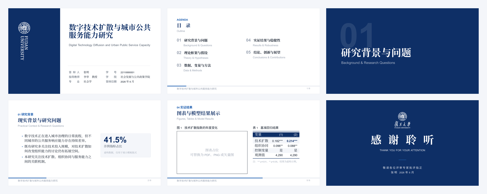

# claudan

[](LICENSE)


[](https://www.overleaf.com/docs?snip_uri=https://github.com/liantaook97/claudan/archive/refs/heads/main.zip)

欢迎使用 claudan！

claudan 是复旦大学的非官方 Beamer 模板。名字来自 Claude + Fudan，整体视觉采用 2026 年最流行的衬线字体 + 大留白 + 卡片式的 Claude Design-Like 风格，底部有演示进度条。注意：由于大量 AI 生成的 PPT 都采用了这种风格，可能会给人留下「一眼 AI」的印象，使用前请务必自行斟酌。

## 预览

> 配色以 `#0E2F66` 为主，中英文双语版式，16:9 宽屏比例。



> 注意：复旦官方蓝（`#083090`）大面积铺色时显示效果不佳，因此主色改用了比官方蓝更深的 `#0E2F66`。

## 环境要求

- **必须使用 XeLaTeX 编译**（依赖 `ctex` + `fontspec` 处理中文与字体）。文件首行的 `% !TEX program = xelatex` 已为支持的编辑器声明编译器。
- Overleaf 直接可用（编译器选 XeLaTeX）。

### 字体

主题对中文字体做了多级 fallback，**装有以下任意一个即可**，无需手动配置：

- 正文（宋体）：`Source Han Serif SC` → `Noto Serif CJK SC` → `思源宋体` → `Songti SC`
- 标题/强调（黑体）：`Source Han Sans SC` → `Noto Sans CJK SC` → `思源黑体` → `PingFang SC` → `Songti SC`
- 西文无衬线：`Arial` → `Latin Modern Sans`

> 提示：`Songti SC` / `PingFang SC` 仅 macOS 自带。Windows / Linux / Overleaf 用户建议安装**思源宋体 / 思源黑体**（Source Han / Noto CJK）以获得一致效果。

## 快速开始

### 方式一：Overleaf（推荐，零环境）

点上方的 **[Open in Overleaf]** 按钮，会把整个仓库导入为一个新的 Overleaf 项目。导入后做两件事即可编译：

1. **Menu → Compiler → 选 `XeLaTeX`**（Overleaf 不会自动读 `% !TEX program` 那行，默认 pdfLaTeX 会报错）。
2. **Menu → Main document → 选 `main.tex`**（仓库里 `main.tex` 与 `example.tex` 都是可编译主文件，需手动指定）。

字体无需配置：Overleaf 自带 Source Han / Noto CJK，README 中的 fallback 链会自动命中。

### 方式二：本地编译

编辑 `main.tex` 即可开始使用。

```bash
git clone https://github.com/liantaook97/claudan
cd claudan

# 推荐:latexmk 自动判断编译次数
latexmk -xelatex main.tex

# 或手动编译,务必跑两遍（首遍页码/进度条/背景尚未稳定）
xelatex main.tex
xelatex main.tex
```

> ⚠️ **一定要编译两遍**（或用 `latexmk`）。只跑一遍会出现页码错位、背景色块缺失等现象。

## 完整示例与自定义命令

`example.tex` 是一份完整的可编译示例，演示了主题提供的全部自定义命令。**不确定某个命令怎么用时，直接到 `example.tex` 里对照即可。**

主题在 `\begin{document}` 内提供以下命令：

| 命令                                          | 用途                                                        | 参数                     |
| --------------------------------------------- | ----------------------------------------------------------- | ------------------------ |
| `\fducoverinfo{...}`                        | 在导言区填写封面信息（学号、导师、专业、答辩日期等键值对）  | `key = value` 列表     |
| `\fdutitlepage`                             | 生成封面页（读取`\title` / `\author` 及上面的封面信息） | 无                       |
| `\fduagenda{...}`                           | 目录页容器                                                  | 内部放`\fduagendaitem` |
| `\fduagendaitem{编号}{中文}{英文}`          | 单个目录条目                                                | 3                        |
| `\fdudivider{编号}{中文标题}{英文标题}`     | 章节过渡页                                                  | 3                        |
| `\fducontenthead{眉标}{中文标题}{英文标题}` | 内容页页眉（每个`frame` 开头调用）                        | 3                        |
| `\fducard{标题}{正文}`                      | 卡片块                                                      | 2                        |
| `\fdudatacard{大数字}{标签}{说明}`          | 数据卡（突出单个指标）                                      | 3                        |
| `\fdulabelcard{标签}{标题}{正文}`           | 带角标的卡片（如 THEORY / METHOD）                          | 3                        |
| `\fdunumitem{编号}{要点}{展开说明}`         | 带编号的要点条目                                            | 3                        |
| `\fduthankyou{中文致谢}{英文致谢}`          | 致谢/结束页                                                 | 2                        |
| `\fdusans`                                  | 临时切换到无衬线黑体（用于图表标签等）                      | 无                       |

> 以下配色变量也可直接在 `\color{}` 中使用，示例见 `example.tex` 的流程图与表格：`FudanBlue`（主色深蓝）、`AccentBlue`（强调亮蓝）、`Sub`（正文辅助深灰）、`Muted`（弱化浅灰）、`Tint`（极浅蓝灰底色）、`Line`（分隔线浅灰）。

## 许可证

本项目**代码部分**（`.sty`、`.tex`）以 [MIT 许可证](LICENSE) 发布。本仓库 `figures/` 下的复旦大学校徽**版权归复旦大学所有**。不在本项目开源许可范围内，仅供本校师生在学位答辩等场景使用。校属各单位及个人以经营为目的使用视觉形象识别系统，须向学校申请使用许可。校外单位及个人未经许可，不得制作或使用载有视觉形象识别系统的物品。